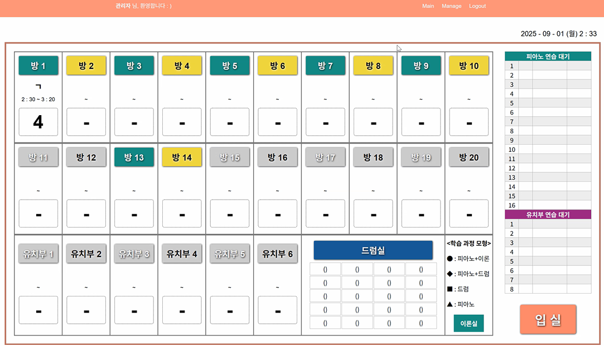
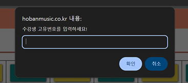
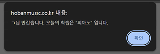
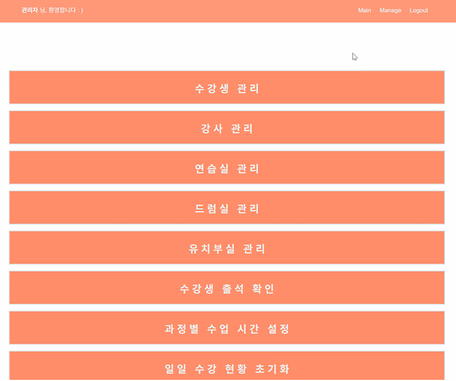

# [프로젝트명: shhoban_piano]

## 1. 프로젝트 사전 점검

- 현재상황: 기존 홈페이지 유지보수 불가 상태
  - 원인 : 관련 소스코드, 기타 산출물 자료가 없음.
    - 닷홈에서 호스트 중이나, 접속 정보를 알 수 없어서 소스코드 접근 불가.

  - 참고사항1 : php 기반 웹 페이지
  - 참고사항2 : 도메인 주소 (www.hobanmusic.co.kr)
  - 참고사항3 : 도메인 주소는 추후 변경 예정.
  
## 2. 프로젝트 요구 사항
- 요구사항1 : 기존 홈페이지 기능에서 살릴 건 살리고, 버릴 건 버리기.

- 요구사항2 : 단, 기간은 10월 중순 런칭 전까지 (권장 기간: 9월 말)

## 3. 프로젝트 일정 수립 
    - 최대한 타이트하게 먼저 잡은 후, 러프하게 일정 조절. (늦어도 10월 초에는 완성하는 방향으로)

### - 9월 1주차 (9월 2일 ~ 9월 5일)
    - 기존 프로그램 분석
    - 프로그램 초기 구축
    - 데이터베이스 연동

#### 9월 2일 (화) 일정
    - 11:30 ~ 12:00 미팅 
  
#### 9월 3일 (수) 일정
    - 기존 프로그램 분석
    - 프로그램 환경 초기 구축 (웹)
      - next.js 

#### 9월 4일 (목) 일정
    - 기존 프로그램 분석 마무리 
    - 프로그램 환경 초기 구축 (데이터베이스)
      - neon (postgres)
      - 데이터베이스 연동, DB 접속 확인
  
#### 9월 5일 (금) 일정
    - 기존 분석 토대로 DB 테이블 구축 초안 잡기.

### - 9월 2주차 (9월 8일 ~ 9월 12일)
    - 기존 분석 토대로 DB 테이블 구축 시작

    - 기능 구상 및 구현 초안 잡기
      - "로그인/로그아웃 페이지 "기능" 구현 초안
      - "설정 관리" 각 페이지 "화면" 구현 초안
      - "메인화면" 페이지 "화면" 구현 초안
      - 각 페이지에 대한 CRUD "기능" 구현 초안

### - 9월 3주차 (9월 15일 ~ 9월 19일)
    - 기능 세부 구현 시작
      - "수강생 관리" 페이지
      - "강사 관리" 페이지
      - "연습실 관리" 페이지
      - "드럼실 관리" 페이지 
      - "유치부실 관리" 페이지 
      - "수강생 출석 확인" 페이지 
      - "과정별 수업 시간 설정" 페이지 
      - "일일 수강 현황 초기화" 페이지 

### - 9월 4주차 (9월 22일 ~ 9월 26일)
    - 기능 세부 구현 (이어서 계속 진행)
  
### - 9월 5주차 (9월 29일 ~ 9월 30일)
    - 기능 구현 마무리
    - 기능 테스트
    - 기능 최종 점검 및 산출물 정리

### - 10월 1주차 (10월 1일 ~ 10월 3일)
    - 프로그램 모니터링
---

## 4. 프로젝트 기술 선정
- 프레임워크 : next.js 
- 배포 및 호스팅 : Vercel 
  - (빌드 + 배포 + 호스팅까지 모두 가능한 클라우드 플랫폼) 
- DB : Neon (Serverless Postgres) 
  - vercel에서 extension으로 제공.

## 5. 기존 홈페이지 분석
### 5-1. 메인 화면 
#### 5-1-1. 관리자 계정으로 로그인 진행 후 메인 화면

    - 화면 설명  : -
    - 역     할  : -
    - 제약사항1  : -
    - 상위 코드  : -
    - 화면 코드  : hb_main
    - 소스파일명 : index.php
    - 부가설명1  : ㄱ
            >> "수강생 이름은 ㄱ"
            >> "Manage - 수강생 관리 - 수강생 이름"에서 확인.
    - 부가설명2  : 2:30 ~ 3:20 
            >> "수강생의 현재 수업 시간
            >> "Manage - 과정별 수업 시간 설정"에서 확인. 
    - 부가설명3  : 4 
            >> 뜻 : 4 * 5분 => 20분 (*시 20분에 수업 종료)
            >> 숫자 1(5분) ~ 12(60분) 
    - 부가설명4  : 회색 배경의 방
            >> "비활성화"된 연습실(예: 방 11, 방 12, 방 15, ..)
            >> "활성화"로 변경을 원하면, "Manage - 연습실 관리 - 기능(활성화)" 클릭
    - 부가설명5  : "입실 취소"를 원할 경우, "Manage - 연습실 관리 - 기능(삭제)" 클릭

#### 5-1-2. (메인화면) "입실" 버튼 클릭 후의 알림창

---
    - 화면 설명  : 수강생 고유번호를 입력하는 알림창
    - 역     할  : 알림창에서 값을 입력 받는다. 
    - 제약사항1  : 고유번호는 숫자 4~5자리 
    - 제약사항2  : 유효하지 않은 고유번호 입력 시 "등록된 수강생이 아닙니다." 알림창 출력.
    - 상위 코드  : hb_main
    - 화면 코드  : hb_main_01
    - 소스파일명 : index.php

#### 5-1-3. (메인화면) "입실" - "수강생 고유번호" 입력 후의 알림창

---
    - 화면 설명   : 알림창 
    - 역    할1   : (오늘 첫 입실 일 경우) 내용 출력 
                    (출력명: "수강생 이름"님 반갑습니다. 오늘의 학습은 "과정명" 입니다.)
    - 역    할2   : (오늘 두 번째 입실일 경우) 내용 출력
                    (출력명1: 진행된 연습시간 *분입니다.)
                    (출력명2: "수강생이름"님 또 만나네요? 오늘의 학습은 "과정명"입니다.)  
    - 제약 사항   : -
    - 상위 코드   : hb_main_01
    - 화면 코드   : hb_process_entrance_001
    - 소스파일명  : process_entrance.php

### 5-2. Manage 페이지

---
    - 화면 설명   : 각 관리페이지로 이동 할 수 있는 버튼 제공 (네비게이터 역할) 
    - 역    할1   : "수강생 관리" 페이지 이동 
    - 역    할2   : "강사 관리" 페이지 이동 
    - 역    할3   : "연습실 관리" 페이지 이동
    - 역    할4   : "드럼실 관리" 페이지 이동
    - 역    할5   : "유치부실 관리" 페이지 이동
    - 역    할6   : "수강생 출석 확인" 페이지 이동
    - 역    할7   : "과정별 수업 시간 설정" 페이지 이동
    - 역    할8   : "일일 수강 현황 초기화" 페이지 이동
    - 제약 사항   : -
    - 상위 코드   : hb_main
    - 화면 코드   : hb_manage
    - 소스파일명  : admin_manage.php

### 5-2-1. 

## 6. 기존 홈페이지 개선 필요 사항
### 6-1. [기능추가] Manage - 수강생 관리 
    - 개선 요청자    : 심희준
    - 개선 필요 내용 : 수강생을 통합으로 검색하는 기능 필요.
    - 개선 필요 사유 : 현재는 CTRL+F로 직접 확인 필요.
### 6-2. [기능개선] Manage - 수강생 관리 - 수강생 추가
    - 개선 요청자    : 심희준
    - 개선 필요 내용 : 고유번호는 휴대폰 8자리 + 예비숫자 1자리 => 숫자 8 ~ 9자리로 관리
    - 개선 필요 사유 : 휴대폰 뒷자리가 같은 사람인 경우?
## 7. 신규 프로그램 초기 설정
### 7-1. [개인PC 개발환경구축]
    - visual studio code 설치
      - 버전: 1.100.3
      - 설치 사이트: https://code.visualstudio.com/docs/?dv=win64user
    - node.js 설치 
      - 버전: 22.19.0 (LTS)
      - 설치 사이트: https://nodejs.org/dist/v22.19.0/node-v22.19.0-x64.msi

## 99. 프로그램 개발 간 오류 기록
### 99-1. vercel 첫 배포
    - 

--
## 000. sample

---
    - 화면 설명   :  
    - 역    할1   : 
    - 제약 사항   : -
    - 상위 코드   : 
    - 화면 코드   : 
    - 소스파일명  : .php

