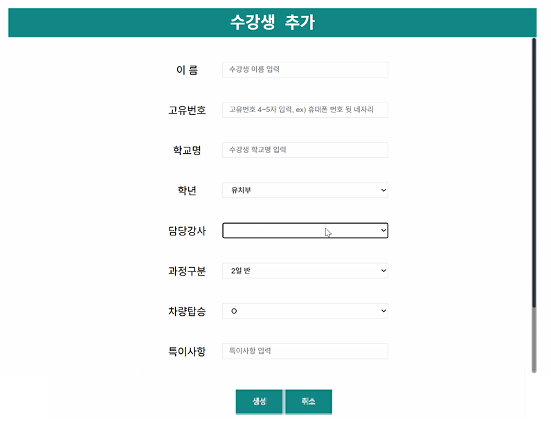
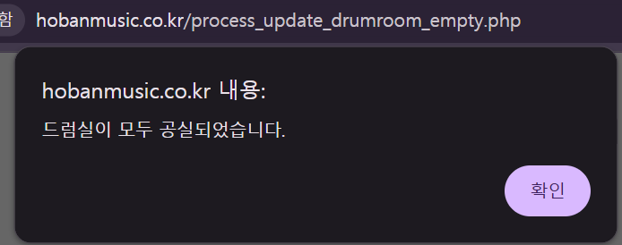

# [프로젝트명: 입/퇴실 프로그램 리뉴얼 (shhoban_piano)]

## 개발 URL 접속 페이지: 
https://shhobanpiano.vercel.app/

## 진행 현황:
- 2025-09-04 (목)
  - [완료] 기존 프로그램 분석 작성 마무리
  - [대기] 데이터베이스 연동 테스트 (Neon - postgres)
  
- 2025-09-03 (수) 
  - [완료] 기존 프로그램 분석 초안 작성  
  - [완료] 테스트 페이지 출력 

## 불필요한 기능 / 추가 필요 기능 조사
- ..

---
## 1. 프로젝트 사전 점검

- 현재상황: 기존 홈페이지 유지보수 불가 상태
  - 원인 : 관련 소스코드, 기타 산출물 자료가 없음.
    - 닷홈에서 호스트 중이나, 접속 정보를 알 수 없어서 소스코드 접근 불가.

  - 참고사항1 : php 기반 웹 페이지
  - 참고사항2 : 도메인 주소 (www.hobanmusic.co.kr)
  - 참고사항3 : 도메인 주소는 추후 변경 예정.
  
## 2. 프로젝트 요구 사항
- 요구사항1 : 기존 홈페이지 기능에서 살릴 건 살리고, 버릴 건 버리기.

- 요구사항2 : 단, 기간은 10월 중순 런칭 전까지 (권장 기간: 9월 말)

## 3. 프로젝트 일정 수립 
    - 최대한 타이트하게 먼저 잡은 후, 러프하게 일정 조절.
    - 늦어도 10월 초에는 완성하기.
    - 일정은 언제든지 수정될 수 있으나, 일정에 맞출 수 있도록 진행하기.

### - 9월 1주차 (9월 2일 ~ 9월 5일)
    - 기존 프로그램 분석
    - 프로그램 초기 구축
    - 데이터베이스 연동

#### 9월 2일 (화) 일정
    - 11:30 ~ 12:00 미팅 
  
#### 9월 3일 (수) 일정
    - 기존 프로그램 분석
    - 프로그램 환경 초기 구축 (웹)
      - next.js 
    - 프로그램 환경 초기 구축 (vercel - github 연동)

#### 9월 4일 (목) 일정
    - 기존 프로그램 분석 마무리 
    - 프로그램 환경 초기 구축 (데이터베이스)
      - neon (postgres)
      - 데이터베이스 연동, DB 접속 확인
  
#### 9월 5일 (금) 일정
    - DB 테이블 구축 초안 잡기 (기존 홈페이지 참조)

### - 9월 2주차 (9월 8일 ~ 9월 12일)
    - DB 테이블 구축 시작 (기존 홈페이지 참조)

    - 기능 구상 및 구현 초안 잡기
      - "로그인 페이지 "기능" 구현 초안
      - "설정 관리" 각 페이지 "화면" 구현 초안
      - "메인화면" 페이지 "화면" 구현 초안
      - 각 페이지에 대한 CRUD "기능" 구현 초안

### - 9월 3주차 (9월 15일 ~ 9월 19일)
    - 기능 세부 구현 시작
      - "로그인 페이지 
      - "수강생 관리" 페이지 
      - "강사 관리" 페이지 
      - "연습실 관리" 페이지
      - "드럼실 관리" 페이지 
      - "유치부실 관리" 페이지 
      - "수강생 출석 확인" 페이지 
      - "과정별 수업 시간 설정" 페이지 
      - "일일 수강 현황 초기화" 페이지 

### - 9월 4주차 (9월 22일 ~ 9월 26일)
    - 기능 세부 구현 (이어서 계속 진행)
  
### - 9월 5주차 (9월 29일 ~ 9월 30일)
    - 기능 구현 마무리
    - 기능 테스트
    - 기능 최종 점검 및 산출물 정리

### - 10월 1주차 (10월 1일 ~ 10월 3일)
    - 프로그램 모니터링
---

## 4. 프로젝트 기술 선정
- 프레임워크 : next.js 
- 배포 및 호스팅 : Vercel 
  - (빌드 + 배포 + 호스팅까지 모두 가능한 클라우드 플랫폼) 
- DB : Neon (Serverless Postgres) 
  - vercel에서 extension으로 제공.

## 5. 기존 홈페이지 분석
### 5-1. 메인 화면 
#### 5-1-1. 로그인 하지 않은 메인화면

    - 화면 설명   : 홈페이지 접속 시 보이는 첫 화면
    - 역    할1   : "Main" 버튼
                    (메인화면으로 이동)
    - 역    할2   : "Login" 버튼
                    ("로그인화면" 페이지로 이동)
    - 역    할3   : "현재 날짜, 요일 및 시간 출력

#### 5-1-2. 메인 화면 (계정 로그인 진행 후)

    - 화면 설명   : 수강생 입실 현황을 보여줌.
    - 역    할1   : "강사" 버튼 [~~~님, 환영합니다:)]
                    ("mypage" 이동)
    - 역    할2   : "Main" 버튼
                    (메인화면으로 이동)
    - 역    할3   : "Manage" 버튼
                    ("관리페이지"로 이동)
    - 역    할4   : "Logout" 버튼
                    ("로그아웃" 진행)
                    (process_logout.php)
    - 역    할5   : "현재 날짜, 요일 및 시간 출력
    - 역    할6   : "현재 입실 현황" 출력
                    (방1 ~ 방20)
                    (유치부1 ~ 유치부6)
    - 역    할7   : "드럼실 입실 현황" 출력
    - 역    할8   : "피아노 연습 대기 현황" 출력 
                    (현재 16명까지 대기 출력)
    - 역    할9   : "유치부 연습 대기 현황" 출력
                    (현재 8명까지 대기 출력)
    - 역    할10   : "이론실" 버튼
                    ("이론실관리" 페이지로 이동)
    - 역    할11  : "입실" 버튼
                    (정해진 과정에 따라 알맞은 방으로 입실 처리)     
    - 제약사항1   : -
    - 부가설명1   : ㄱ
            >> "수강생 이름은 ㄱ"
            >> "Manage - 수강생 관리 - 수강생 이름"에서 확인.
    - 부가설명2   : 2:30 ~ 3:20 
            >> "수강생의 현재 수업 시간
            >> "Manage - 과정별 수업 시간 설정"에서 확인. 
    - 부가설명3   : 4 
            >> 뜻 : 4 * 5분 => 20분 (*시 20분에 수업 종료)
            >> 숫자 1(5분) ~ 12(60분) 
    - 부가설명4   : 회색 배경의 방
            >> "비활성화"된 연습실(예: 방 11, 방 12, 방 15, ..)
            >> "활성화"로 변경을 원하면, "Manage - 연습실 관리 - 기능(활성화)" 클릭
    - 부가설명5   : "입실 취소"를 원할 경우, "Manage - 연습실 관리 - 기능(삭제)" 클릭
    - 상위 코드   : -
    - 화면 코드   : hb_02_main
    - 소스파일명  : index.php

#### 5-1-3. "이론실관리" (메인화면 - "이론실" 버튼 클릭)

    - 화면 설명   : "이론실"에 입실한 수강생 현황을 보여줌.
    - 역할    1   : 이론 수업 받는 수강생 정보 출력
                    (번호)
                    (이름 (학년))
                    (고유번호)
                    (입실)
                    (이론진행 (분))
                    (기능)
    - 특이 사항   : 실제 기능 사용중인지 확인 필요
    - 상위 코드   : hb_02_main
    - 화면 코드   : hb_03_theoryroom_manage
    - 소스파일명  : theoryroom_manage.php

#### 5-1-4. (메인화면) "입실" 버튼 클릭 후의 알림창

---
    - 화면 설명   : 수강생 고유번호를 입력하는 알림창
    - 역     할   : 알림창에서 값을 입력 받는다. 
    - 제약사항1   : 고유번호는 숫자 4~5자리 
    - 제약사항2   : 유효하지 않은 고유번호 입력 시 "등록된 수강생이 아닙니다." 알림창 출력.
    - 상위 코드   : hb_02_main
    - 화면 코드   : hb_04_ipsil
    - 소스파일명  : index.php

#### 5-1-5. (메인화면) "입실" - "수강생 고유번호" 입력 후의 알림창

---
    - 화면 설명   : 알림창 
    - 역    할1   : (오늘 첫 입실 일 경우) 내용 출력 
                    (출력명: "수강생 이름"님 반갑습니다. 오늘의 학습은 "과정명" 입니다.)
    - 역    할2   : (오늘 두 번째 입실일 경우) 내용 출력
                    (출력명1: 진행된 연습시간 *분입니다.)
                    (출력명2: "수강생이름"님 또 만나네요? 오늘의 학습은 "과정명"입니다.)  
    - 제약 사항   : -
    - 상위 코드   : hb_04_ipsil
    - 화면 코드   : hb_05_process_entrance
    - 소스파일명  : process_entrance.php

### 5-2. Manage 페이지

---
    - 화면 설명   : 각 관리페이지로 이동 할 수 있는 버튼 제공 (네비게이터 역할) 
    - 역    할1   : "수강생 관리" 페이지 이동 
    - 역    할2   : "강사 관리" 페이지 이동 
    - 역    할3   : "연습실 관리" 페이지 이동
    - 역    할4   : "드럼실 관리" 페이지 이동
    - 역    할5   : "유치부실 관리" 페이지 이동
    - 역    할6   : "수강생 출석 확인" 페이지 이동
    - 역    할7   : "과정별 수업 시간 설정" 페이지 이동
    - 역    할8   : "일일 수강 현황 초기화" 페이지 이동
    - 제약 사항   : -
    - 상위 코드   : hb_02_main
    - 화면 코드   : hb_06_admin_manage
    - 소스파일명  : admin_manage.php

### 5-2-1. Manage - 수강생관리 

---
    - 화면 설명   : "수강생 관리"
    - 역    할1   : "수강생 추가" 페이지 이동
    - 역    할2   : "수강생 목록" 출력
                    (순번) - auto increment 확인, sequence 할당 필요
                    (이름)
                    (고유번호)
                    (학교)
                    (학년)
                    (담당강사)
                    (과정구분)
                    (차량) -  항목 값 "O"일 경우 차량이미지" 표시
                    (기능) - "수정" / "삭제"
    - 역    할3   : "수강생 목록" - "기능" - "정보수정"
    - 역    할4   : "수강생 목록" - "기능" - "과정수정"
    - 제약 사항   : "수강생 목록" - "기능" - "삭제" (수강생 삭제)
    - 상위 코드   : hb_06_admin_manage
    - 화면 코드   : hb_08_student_manage
    - 소스파일명  : student_manage.php
  
### 5-2-1-1. Manage - 수강생관리 - 수강생추가

---
    - 화면 설명   : "수강생 추가"
    - 역    할1   : "이름" 입력
    - 역    할2   : "고유번호" 입력
    - 역    할3   : "학교명" 입력
    - 역    할4   : "학년" 선택
                    (유치부)
                    (1학년)
                    (2학년)
                    (3학년)
                    (4학년)
                    (5학년)
                    (6학년)
                    (중·고등부)
                    (대회부)
                    (연주회부)
                    (성인부)
    - 역    할5   : "담당강사" 선택
                    (1 - "강사이름")
                    (2 - "강사이름")
                    (3 - 뷰01)
                    (3 - 뷰02)
                    (3 - 뷰03)
    - 역    할6   : "과정구분" 선택
                    (2일 반)
                    (3일 반)
                    (4일 반)
                    (5일 반)
    - 역    할7   : "차량탑승" 선택
                    (X)
                    (O)
    - 역    할8   : "특이사항" 입력
    - 역    할9   : "수정" 버튼 (submit)
    - 역    할10  : "취소" 버튼 (reset-실제 작동하지 않음)
    - 제약 사항   : -
    - 상위 코드   : hb_07_student_manage
    - 화면 코드   : hb_09_student_create_form
    - 소스파일명  : student_create_form.php

### 5-2-1-2. Manage - 수강생관리 - 정보 수정

---
    - 화면 설명   : 수강생 수정 화면 
    - 역    할1   : "이름" 출력 및 입력 가능
    - 역    할2   : "고유번호" 출력 및 입력 가능
    - 역    할3   : "학교명" 출력 및 입력 가능
    - 역    할4   : "학년" 선택
                    (유치부)
                    (1학년)
                    (2학년)
                    (3학년)
                    (4학년)
                    (5학년)
                    (6학년)
                    (중·고등부)
                    (대회부)
                    (연주회부)
                    (성인부)
    - 역    할5   : "담당강사" 선택
                    (1 - "강사이름")
                    (2 - "강사이름")
                    (3 - 뷰01)
                    (3 - 뷰02)
                    (3 - 뷰03)
    - 역    할6   : "과정구분" 선택
                    (2일 반)
                    (3일 반)
                    (4일 반)
                    (5일 반)
    - 역    할7   : "차량탑승" 선택
                    (X)
                    (O)
    - 역    할8   : "특이사항" 출력 및 입력 가능
    - 역    할9   : "수정" 버튼 (submit)
    - 역    할10  : "취소" 버튼 (reset-실제 작동하지 않음)
    - 특이 사항1  : 역할5 파트 - (강사구분이 "0" 코드는 보이지 않음.)
    - 상위 코드   : hb_07_student_manage
    - 화면 코드   : hb_09_student_update_form
    - 소스파일명  : student_update_form.php

### 5-2-1-3. Manage - 수강생관리 - 과정 수정

---
    - 화면 설명   : 요일별로 "과정" 설정
    - 역    할1   : "요일" 설정
    - 역    할2   : "과정" 선택
                    (피아노+이론)
                    (피아노+드럼)
                    (드럼)
                    (피아노)
    - 역    할3   : "수정" 버튼 (submit)
    - 역    할4  : "취소" 버튼 (reset-실제 작동하지 않음)
    - 특이 사항1  : -
    - 상위 코드   : hb_07_student_manage
    - 화면 코드   : hb_10_student_detail_update_form
    - 소스파일명  : student_detail_update_form.php

### 5-2-1-4. Manage - 수강생관리 - 삭제
---
    - 화면 설명   : 회원 삭제
    - 역    할1   : "삭제" 버튼 클릭 시 메시지 출력

### 5-2-2. Manage - 강사관리 

---
    - 화면 설명   : "강사 관리"
    - 역    할1   : "강사 추가" 페이지 이동
    - 역    할2   : "강사 목록" 출력
                    (순번)
                    (아이디) - * 임시로 가려두었음.
                    (이름)
                    (강사구분)
                    (기능) - "수정" / "삭제"
    - 제약 사항   : -
    - 상위 코드   : hb_06_admin_manage
    - 화면 코드   : hb_11_member_manage
    - 소스파일명  : member_manage.php

### 5-2-2-1. Manage - 강사관리 - 강사 추가

---
    - 화면 설명   : "강사 추가"
    - 역    할1   : "아이디" 입력
    - 역    할2   : "비밀번호 입력"     
    - 역    할3   : "이름 입력"   
    - 역    할4   : "강사구분 입력"    
    - 제약 사항   : -
    - 상위 코드   : hb_11_member_manage
    - 화면 코드   : hb_12_member_
    - 소스파일명  : member_update_form.php

### 5-2-2-2. Manage - 강사관리 - 강사 수정

---
    - 화면 설명   : "강사 수정"
    - 역    할1   : "아이디" 출력 - * 수정 불가
    - 역    할2   : "비밀번호" 입력 - * 입력 시  비밀번호 변경
    - 역    할3   : "이름" 입력 (수정)
    - 역    할4   : "강사구분" 입력 (수정)   
    - 제약 사항   : -
    - 상위 코드   : hb_11_member_manage
    - 화면 코드   : hb_13_member_update_form
    - 소스파일명  : member_update_form.php

---
### 5-2-3. Manage - 연습실관리

---
    - 화면 설명   : "연습실 현황 + 수동 퇴실(삭제) + 방 활성화/비활성화 + 전체 공실/특강"
    - 역    할1   : 각 연습실 입실 현황 출력
                    (번호) - * 방 번호
                    (이름 (학년))
                    (고유번호)
                    (입실)
                    (퇴실)
                    (분침)
                    (사용유무) * 사용 시 "1", 미사용 시 "0"
                    (기능 - 삭제) 
                      * 삭제 시 알림창 팝업 출력
                        (연습실1이 공실 처리 되었습니다.)
                      * 코드: process_practiceroom_delete.php?no=1
                    (기능 - [활성화]) 
                      * 알림창 팝업 출력
                        (연습실20이 비활성화 처리 되었습니다.)
                      * 코드: process_practiceroom_activate.php?no=20
                    (기능 - [비활성화])
                      * 알림창 팝업 출력
                        (연습실20이 비활성화 처리 되었습니다.)
                      * "활성화" 코드와 동일.
                      * 코드: process_practiceroom_activate.php?no=20 
    - 상위 코드   : hb_06_admin_manage
    - 화면 코드   : hb_14_practiceroom_manage
    - 소스파일명  : practiceroom_manage.php

### 5-2-3-1. Manage - 연습실관리 - 전체공실

---
    - 역    할1   :   * 적용 시 알림창 팝업 출력
                      (연습실이 모두 공실되었습니다.)
                      * 메인화면으로 돌아감.
    - 상위 코드   : hb_14_practiceroom_manage
    - 화면 코드   : hb_15_process_update_practiceroom_empty
    - 소스파일명  : process_update_practiceroom_empty.php
  
### 5-2-3-2. Manage - 연습실관리 - 전체특강

---
    - 기능필요여부: 확인필요.
    - 상위 코드   : hb_14_practiceroom_manage
    - 화면 코드   : hb_16_process_update_practiceroom_speciallecture 
    - 소스파일명  : process_update_practiceroom_speciallecture.php

### 5-2-4. Manage - 드럼실관리

---
    - 참고 사항   : 연습실관리 페이지와 매우 유사 
    - 역    할1   : 각 드럼실 입실 현황 출력
                    (번호) - * 방 번호
                    (이름 (학년))
                    (고유번호)
                    (입실)
                    (퇴실)
                    (분침)
                    (사용유무) * 사용 시 "1", 미사용 시 "0"
                    (기능 - 삭제) 
                      * 삭제 시 알림창 팝업 출력
                        (드럼실1이 공실 처리 되었습니다.)
                      * 코드: process_drumroom_delete.php?no=1
    - 상위 코드   : hb_06_admin_manage
    - 화면 코드   : hb_17_drumroom_manage
    - 소스파일명  : drumroom_manage.php
    - 
### 5-2-4-1. Manage - 드럼실관리 - 전체공실

---
    - 역    할1   : 모든 드럼실 공실 처리
    - 상위 코드   : hb_17_drumroom_manage
    - 화면 코드   : hb_18_process_update_drumroom_empty
    - 소스파일명  : process_update_drumroom_empty.php

---
### 5-2-5. Manage - 유치부실관리

---
    - 참고 사항   : 연습실관리 페이지와 매우 유사
    - 역할    1   : 각 유치부실 입실 현황 출력
                    (기능 - 삭제)
                      * 코드: process_kinderroom_delete.php
                    (기능 - 활성화)
                      * 코드: process_kinderroom_activate.php
                    (기능 - 비활성화)
                      * 코드: process_kinderroom_activate.php

    - 상위 코드   : hb_06_admin_manage
    - 화면 코드   : hb_19_kinderroom_manage
    - 소스파일명  : kinderroom_manage.php 
  
### 5-2-5-1. Manage - 유치부실관리 - 전체공실
---
    - 상위 코드   : hb_19_kinderroom_manage
    - 화면 코드   : hb_20_process_update_kinderroom_empty
    - 소스파일명  : process_update_kinderroom_empty.php 

### 5-2-5-2. Manage - 유치부실관리 - 전체특강
---
    - 상위 코드   : hb_19_kinderroom_manage
    - 화면 코드   : hb_21_process_update_kinderroom_speciallecture
    - 소스파일명  : process_update_kinderroom_speciallecture.php 

---
### 5-2-6. Manage - 수강생출석확인

---
    - 화면 설명   : 수강생출석현황을 "연도", "월", "일" 각각 지정하여 확인
    - 역할   1    : "확인" 버튼
                    (버튼 클릭 시 아래의 파라미터를 받아 내용 출력)
                    (파라미터: year=2025&month=09&day=04)
                    * 출석 현황이 없을 경우 알림 팝업 출력
                      - 해당 날짜에 수강생 출석현황이 없습니다!
    - 상위 코드   : hb_06_admin_manage
    - 화면 코드   : hb_22_student_attendance
    - 소스파일명  : student_attendance.php

### 5-2-7. Manage - 과정별 수업 시간 설정
---
    - 화면 설명   : 각 과정별로 수업 시간 설정
    - 역할   1    : "시간(분)" 입력 
    - 역할   2    : "설정" 버튼 (submit)
    - 역할   3    : "취소" 버튼 (reset-실제로 동작하지 않음)
    - 상위 코드   : hb_06_admin_manage
    - 화면 코드   : hb_23_class_time_setup_form
    - 소스파일명  : class_time_setup_form.php

### 5-2-8. Manage - 일일 수강 현황 초기화
---
    - 상위 코드   : hb_06_admin_manage
    - 화면 코드   : hb_24_process_situation_reset
    - 소스파일명  : process_situation_reset.php

### 5-3. Login
---
    - 화면 설명   : "로그인 페이지"
    - 역    할1   : "아이디" 입력
    - 역    할2   : "비밀번호" 입력 
    - 역    할3   : "로그인" 버튼
                    (process_login.php)
    - 상위 코드   : hb_02_main
    - 화면 코드   : 작성필요
    - 소스파일명  : member_login.php
  
### 5-4. mypage
---
    - 특이 사항   : 일부 수강생 내역만 나옴. 
    - 화면 설명   : 수강생 정보가 떠있으나, 정확한 목적을 알 수 없음.
    * 참조 링크1  : (원장님)
      - process_lesson_check.php?key=02312&no=1&class=1
  
    * 참조 링크2  : (강사님)
      - process_lesson_check.php?key=02312&no=2&class=1
      - process_lesson_check.php?key=65312&no=2&class=4

    * 참조 링크3  : (차량)
      - process_vehicle_check.php?key=4693&vehicle=1

    - 상위 코드   : hb_02_main
    - 화면 코드   : hb_**_mypage
    - 소스파일명  : mypage.php

## 6. 초기 설정
### 6-1. [개인PC 개발환경구축]
    - visual studio code 설치
      - 버전: 1.100.3
      - 설치 사이트: https://code.visualstudio.com/docs/?dv=win64user
    - node.js 설치 
      - 버전: 22.19.0 (LTS)
      - 설치 사이트: https://nodejs.org/dist/v22.19.0/node-v22.19.0-x64.msi
    - npm install 진행 (vscode 터미널에서)
    - npm run dev 명령어 인식 여부 확인.

## 7. 사용 라이브러리 및 라이선스 확인
### 7-1. "라이브러리 이름"

## 8. 기존 홈페이지 개선 필요 사항
### 8-1. [기능추가] 
    - 개선 요청자    : 심희준
    - 관련   기능    : Manage - 수강생 관리 
    - 개선 필요 내용 : 수강생을 통합으로 검색하는 기능 필요.
    - 개선 필요 사유 : 현재는 CTRL+F로 직접 확인 필요.

### 8-2. [기능개선] 
    - 개선 요청자    : 심희준
    - 관련   기능    : Manage - 수강생 관리 - 수강생 추가
    - 개선 필요 내용 : 고유번호는 휴대폰 8자리 + 예비숫자 1자리 => 숫자 8 ~ 9자리로 관리
    - 개선 필요 사유 : 휴대폰 뒷자리가 같은 사람인 경우?

### 8-3. [sample] 
    - 개선 요청자    : sample
    - 관련   기능    : sample
    - 개선 필요 내용 : sample
    - 개선 필요 사유 : sample

## 9-1. 기능 점검 필요 사항
    - 메인 화면 >> 이론실 버튼
      - 수강생이 "피아노" 연습 시간이 종료되었을 때 , "이론실"로 자동으로 넘어가는지 기능 확인 필요.

## 10-1 회의록
### [회의_00] 2025.00.00
      - 1. 
  
### [회의_00] 2025.00.00
      - 1. 
  
## 99. 프로그램 개발 간 오류 기록
### 99-1. test
    - 오류 발생 시간대 : 
    - 오류 원인 :
    - 오류 해결 방법 : 

---

